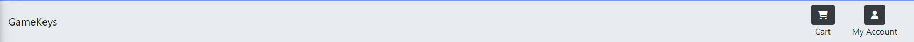
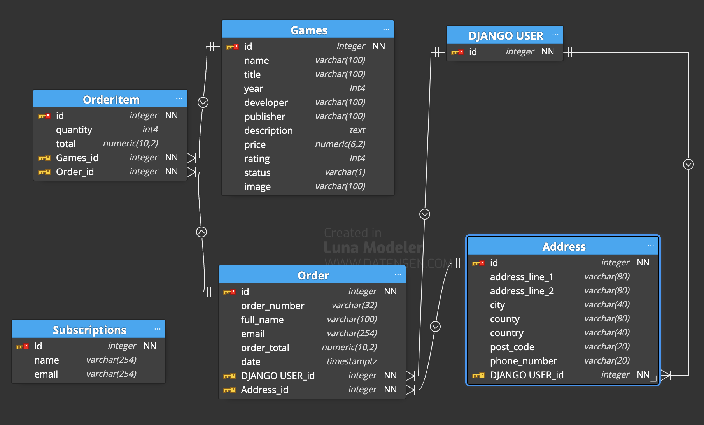

# **Game Keys**

You can see the live
website [here](https://browne878-game-keys.herokuapp.com/).

The purpose of this website is to make games widely available to the public. This website is meant to be used by anyone who
is looking for a new game to play. Games should be cheap and easy to find.

My aim for Game Keys is to bring low cost games to everyone. I want to make them easily accessible to everyone.

## **Table of Contents**

- ### [Business Model](https://github.com/browne878/pp5-game-keys#business-model-1)

- ### [Planning](https://github.com/browne878/pp5-game-keys#planning-1)

- ### [Features](https://github.com/browne878/pp5-game-keys#features-1)

- ### [Models](https://github.com/browne878/pp5-game-keys#models-1)

- ### [Future Development](https://github.com/browne878/pp5-game-keys#future-development-1)

- ### [Testing](https://github.com/browne878/pp5-game-keys#testing-1)

- ### [Bugs](https://github.com/browne878/pp5-game-keys#bugs-1)

  - [Unfixed Bugs](https://github.com/browne878/pp5-game-keys#unfixed-bugs)
  - [Fixed Bugs](https://github.com/browne878/pp5-game-keys#fixed-bugs)

- ### [Deployment](https://github.com/browne878/pp5-game-keys#deployment-1)

  - [Cloning/Forking Repository](https://github.com/browne878/pp5-game-keys#cloning--forking-repository)
  - [Local Deployment](https://github.com/browne878/pp5-game-keys#local-deployment)
  - [Remote Deployment](https://github.com/browne878/pp5-game-keys#remote-deployment)

- ### [Credits](https://github.com/browne878/pp5-game-keys#credits-1)

## **Business Model**

Game Keys is a B2C business model. This means that the business is selling to consumers. By selling directly to customers I can keep prices
low and make games more accessible to everyone.

I have created a facebook page for the business. This can be found [here](/readme/images/social_mocks/facebook-mock.png).

To expand the business, I would focus on the social media aspect. I would create a facebook page and a twitter account. I would then use these
to promote the business and drive traffic to the website.

I would also create a discord server. After research, I have discovered that discord is a popular platform for gamers. I would use this to
promote the business and drive traffic to the website.

As business grows, I would then expand to advertising via content creators. Content creators entire audience are games so would maximise
the potential business driven to the website from that investment.

It is also important for the business to take into consideration GDPR. This is because the business is collecting personal information from
users. To stay within the bounds of GDPR, I will ensure on required information is collected and stored. I will also ensure that users can
request to have their information deleted. This will be done by creating a contact form on the website.

## **Planning**

All user stories can be found documented in the issues section of the repository.

- Wireframes

I have created wireframes for every page of the website. There can be found [here](/readme/images/wireframes/)

I have kept the designs relatively simple to allow for changes in the development process. By doing this I was able to make slight changes
to the design without impacting to development timeline.

## **Features**

- Navbar



A simple navbar that is present on most pages. The game keys logo is a link back to the home page. It also has direct access to the cart and profile via the buttons.

- Footer


A simple footer that is present on all pages. It contains links to the social media pages and has copyright information.

## **Models**

- Subscription Model

I decided to keep this model without a relationship to the other models. This is because I wanted to allow users who have not created an account
to sign up to the newsletter. I also wanted to allow users to sign up to the newsletter without having to make a purchase.

This model contains all the information required to maintain the subscription.

I could have added a date that the user signed up to the newsletter. If I were to develop this further, I would add this field.

- Game Model

This model contains all the information required to maintain a game object. It has everything required to display a game on the website.

- Order Item Model

This model represents a game in an order. This is separate to allow for there to be multiple copies and contain the total price for the game.

This model has a many to one relationship with the order model. This is because an order can have multiple order items.

- Order Model

This model represents an order. It contains all the information required to store for a model.

This model has a one to many relationship with the order item model. This is because an order can have multiple order items.

It also has a one to one relationship with the user model. This is because an order can only be made by one user.

- Address Model

This model represents an address. It contains all the information required to store for an address.

This model has a one to one relationship with the user model. This is because an address can only be made by one user.



## **Future Development**

In the future, I would like to move administrative function to its own admin portal. This would simplify administrative tasks on the website.
I would also add the ability to trigger newsletters manually as well as introduce new offers into the newsletters.

I would also set up the newsletter to be sent automatically at a set time. This would allow for the newsletter to be sent at a time when users
are most likely to be online.

## **Testing**

### **Automated Testing**

- Testing of all games page.

I created a test to check if the page was loading correctly. I did this by creating a test class and then creating a test function.
This function checks both the response code and the template used. I then ran the test and it passed.

- Testing of home page.

I created a test to check if the page was loading correctly. I did this by creating a test class and then creating a test function.
This function checks both the response code and the template used. I then ran the test and it passed.

- Newsletter signup page.

I created a test to check if the page was loading correctly. I did this by creating a test class and then creating a test function.
This function checks both the response code and the template used. I then ran the test and it passed.

You can see the results of these tests [here](/readme/images/code_validation/automated_tests/automated-test-result.png)

### **Manual Testing**

On all pages of the website I tested the following:

- All links work.
- All buttons work.
- All forms work.
- All images load correctly.
- All text is readable.
- All text is in the correct place.
- All content is correct.
- Pages are responsive.
- All pages are accessible.

For the game creation pages, I tested the following:

- Creating a game by manually navigating to the /games/add page.
- Clicking the edit button above the game on the /games page and editing the game.
- Clicking the delete button above the game on the /games page and deleting the game.

Screenshots of these manual tests can be found [here](/readme/images/manual_testing/games/).

For emails I tested the following:

- Signing up to the newsletter.
- Receiving confirmation of the sign up.
- Making and order and receiving an order confirmation email.

Screenshots of the emails can be found [here](/readme/images/manual_testing/emails/).

Code Validation:
All python code has been run through the [CI Linting Tool](https://pep8ci.herokuapp.com/). The results can be found [here](/readme/images/code_validation/python/).

All css code has been run through the [W3C CSS Validation Tool](https://jigsaw.w3.org/css-validator/). The results can be found [here](/readme/images/code_validation/css/Screenshot%202023-02-27%20at%2018.21.46.png).

All html code has been run through the [W3C HTML Validation Tool](https://validator.w3.org/). The results can be found [here](/readme/images/code_validation/html/).

All javascript code has been run through the [JSHint](https://jshint.com/). The results can be found [here](/readme/images/code_validation/js/).

## **Bugs**

### Unfixed Bugs

- There is one existing issue within the application which still needs to be fixed. When the newsletter emails are sent to the user every 5 minutes,
it runs the function twice, causing 2 emails to be sent to the user. This is a bug which I am still trying to fix.

### Fixed Bugs

- Footer not stuck to the bottom of the page.

This was caused by the content of the page not being long enough to fill the page. In order to resolve this, I added a low-content class to the content
which would set the min-height of the content to 80vh. This would ensure that the content would always be at least 80% of the height of the page.

- Able to checkout without being logged in.

This issue was caused by the checkout page not checking if the user was logged in. In order to resolve this, I added a check to the checkout page
which would redirect the user to the login page if they were not logged in.

## **Deployment**

### Cloning / Forking Repository

In order to Fork the Repository, please follow the instructions below.

1. Navigate to [this](https://github.com/browne878/pp5-game-keys) repository.
2. Next, in the top left of the page, click the fork button.
3. If you are a member of a team, you may need to choose where to Fork the repository too.

Once you have forked the Repository, you can then clone it to your local machine. To do so, please follow the
instructions below.

1. Navigate to your Forked repository.
2. Click the green Code button above the repositories files.
3. Copy the URL in the dropdown window.
4. Next, open command prompt.
5. After this, navigate to the directory you would like to clone the repository too with the following command.

 ```
cd clone location
 ```

6. Then, run the following command.

 ```
git clone URL
 ```

You have now forked and cloned the repository.

### Local Deployment

Before deploying this application locally, you will need to clone or fork the repository. You can find these instructions
[here]().

1. First, you will need to install the requirements. To do so, run the following command.

 ```
pip install -r requirements.txt
 ```

2. Next, you will need to create an `env.py` file in the root directory of the project.
3. Then, you will need to add the following to the `env.py` file.

 ```
import os
 
os.environ["SECRET_KEY"] = "" - Randomly generated string
os.environ["STRIPE_PUBLIC_KEY"] = "" - Stripe public key from your Stripe account
os.environ["STRIPE_SECRET_KEY"] = "" - Stripe secret key from your Stripe account
# os.environ["ENV"] = "True"
```

4. After this, you will need to run the commands below to migrate the models to the database.

 ```
python manage.py makemigrations
python manage.py migrate
 ```

5. Then, you will need to create a superuser to access the admin panel.

 ```
python manage.py createsuperuser
 ```

6. Next, you will need to run the following command to run the application.

 ```
python manage.py runserver
 ```

 The application should now be running locally!

### Remote Deployment

The following instructions will guide you the deployment process for Heroku. I will assume you already have
a [Heroku](https://www.heroku.com/) account.

1. First, follow the instructions to clone the repository to your GitHub.
2. On Heroku, login and navigate to your dashboard.
3. In the top right, click `New` and select `Create a new app`.
4. Next, name your app and select your region and click `Create app`.
5. After this, under the deployment method, select GitHub and link your account with GitHub.
6. Then, search for your cloned repository and click `Connect`.
7. Under the `Automatic deploys` section, ensure the main branch is selected and click the `Enable Automatic Deploys`.
8. Also, under the main branch is selected in the `Manual deploy` section.
9. Next, at the top of the page, navigate to the settings page.
10. After this, go to the resources tab on heroku and search for `Heroku Postgres` under the add-ons tab.
11. Then, you will need to go to [AWS](https://aws.amazon.com/) and sign up.
12. Once you have signed up, go to the s3 service and create a new bucket.
13. Select the region you want to use and enter a unique name for your bucket.
14. Enable ACLs and set Object Owner to Bucket Owner and click create.
15. Select the bucket you just created and click `Properties`.
16. Scroll down to the `Static website hosting` section and click `Edit`.
17. Then, enable `Use this bucket to host a website` and enter `index.html` for the index document and
    `error.html` for the error document.
18. Next, click `Save`.
19. Then, go to the `Permissions` tab, scroll down to CORS, and click `Edit`.
20. Then, add the following to the CORS configuration.

 ```
[
    {
        "AllowedHeaders": [
            "Authorization"
        ],
        "AllowedMethods": [
            "GET"
        ],
        "AllowedOrigins": [
            "*"
        ],
        "ExposeHeaders": []
    }
]
 ```

21. Then, click `Save`.
22. Next, go to the `Access Control List` tab and click `Edit`.
23. After that, tick `Everyone (public access)` for Objects and click `Save`.
24. You have now set up the S3 bucket. The next step is to set up the IAM user. To do so, go to the
    `IAM` service and click `User` on the left.
25. Then, click `Add user`.
26. Next, enter a name for the user and select `Programmatic access` and click `Next: Permissions`.
27. Then, click `Attach existing policies directly` and choose to enter a policy.
28. After this, copy and paste the following policy into the policy editor.

 ```
{
    "Version": "2012-10-17",
    "Statement": [
        {
            "Effect": "Allow",
            "Action": [
                "s3:*",
                "s3-object-lambda:*"
            ],
            "Resource": [
                "arn:aws:s3:::<project-name>/*",
                "arn:aws:s3:::<project-name>/*"
            ]
        }
    ]
}
```

29. Replace `<project-name>` with the name of your project.
30. Then, click `Review policy`.
31. After this, enter a name for the policy and click `Create policy`.
32. Next, search for the policy you just created and tick the checkbox next to it.
33. Then, click `Next: Tags`.
34. After this, click `Next: Review`.
35. Then, click `Create user`.
36. After this, you will be able to download the CSV file. Download this file and keep it safe.
38. Once this is done, you can add the AWS keys to the config vars in Heroku.
40. After this, under the `Config Vars` section, click the `Reveal Config Vars` button and enter the
    following:
    - `SECRET_KEY` : Generate this yourself but make it random so it is secure.
    - `AWS_ACCESS_KEY_ID`: AWS access key from your AWS account
    - `AWS_SECRET_ACCESS_KEY`: AWS secret access key from your AWS account
    - `DEBUG`: This can be added if you want to develop the application further. It will provide debug messages
        in the console. Set this to `True` if you want to use it.
    - `EMAIL_HOST_PASS`: Password of the email account
    - `EMAIL_HOST_USER`: Email address of the email account
    - `STRIPE_PUBLIC_KEY`: Stripe public key from your account
    - `STRIPE_SECRET_KEY`: Stripe secret key from your account
    - `USE_AWS`: True
41. Then, in the section below (`Buildpacks`), click `Add buildpack` and select python.
42. Repeat the previous step, but this time, select NodeJS.
43. Once this is done, ensure that the python build-pack is at the top of the list. (You can drag them to move them).
44. Then, at the top of the page, navigate back to the deployment section.
45. Finally, you can scroll to the bottom of the page and click the `Deploy Branch` button under the `Manual deploy`
    section.
46. Once the deployment is complete, you can click the `Open app` button at the top right of the page. This will open
    the deployed app in a new tab.

## **Credits**

This app was built using only the documentation from Bootstrap, Django and JQuery.

The fps_soldier images was taken from [here](https://unsplash.com/photos/yURb9KJ8vdc).

All game images were sourced from the publisher's website.
